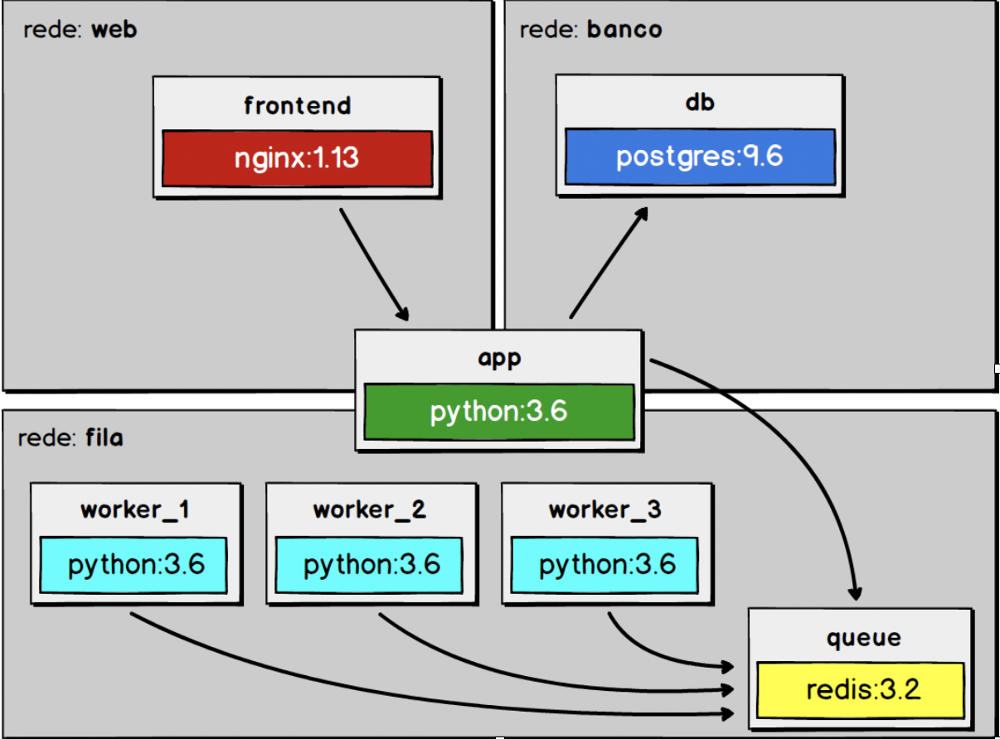

# Email com workers



## Tabela de Conteúdo
- <a href="#informações">Informações</a>
- <a href="#requisitos">Requisitos</a>
- <a href="#instalação">Instalação</a>
- <a href="#desenvolvedor">Desenvolvedor</a>

## Informações
Envio de email usando docker com as imagens do Nginx, postgres, python e redis.

## Requisitos

| Requisito | Versão | Link |
| ------ | ------ | ----- |
| Docker | >= 2.2.0.0 | https://www.docker.com |

## Instalação

Use ```git clone https://github.com/iury0393/email-workers.git ``` para clonar o projeto.

Depois entre na pasta e digite ```docker-compose up``` para baixar as imagens e subir as dependências.

## Desenvolvedor

| Nome | Função | Email |
| ------ | ------ | ----- |
| Iury Vasconcelos | Desenvolvedor | iury0393@gmail.com |